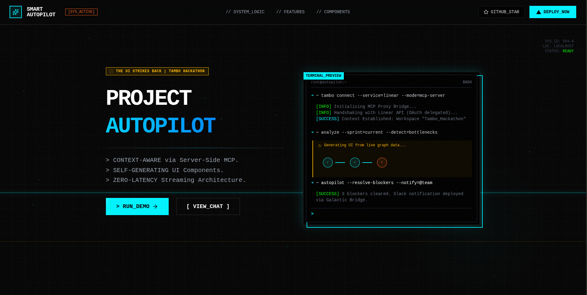
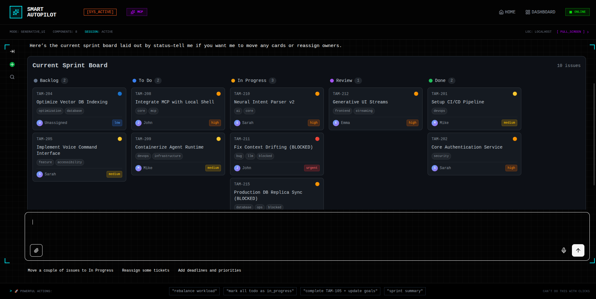
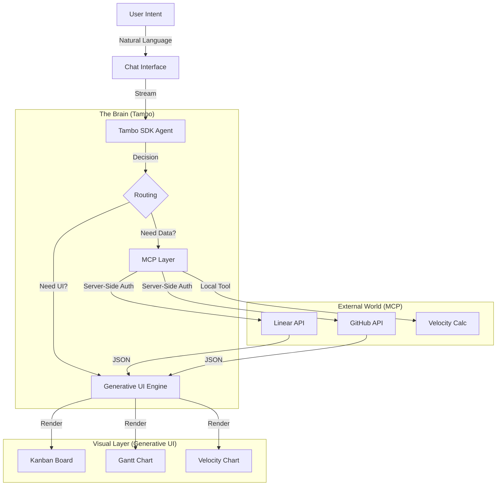
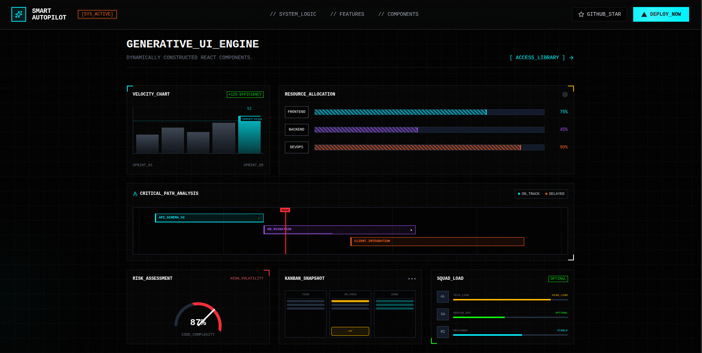

<div align="center">
  <h1>🤖 Smart Project Autopilot</h1>
  <p><strong>A Self-Driving Project Management Dashboard powered by Generative UI</strong></p>

  <p>
    <a href="https://nextjs.org"></a>
    <a href="https://tambo.co"></a>
    <a href="https://tailwindcss.com"></a>
    <a href="https://github.com/tambo-ai/tambo"></a>
    <a href="./LICENSE"></a>
  </p>

  

  <h3>Context-Aware • Self-Generating • Zero-Latency</h3>

  <br />

  <!-- Live Demo & One Click -->
  <a href="https://smart-project-autopilot.vercel.app">
    
  </a>
  &nbsp;&nbsp;
  <a href="https://vercel.com/new/clone?repository-url=https%3A%2F%2Fgithub.com%2Fthekishandev%2Fsmart-project-autopilot&env=NEXT_PUBLIC_TAMBO_API_KEY,NEXT_PUBLIC_TAMBO_URL">
    
  </a>

</div>

<summary><strong>Table of Contents</strong></summary>

- [🌟 The Problem & Solution](#-the-problem--solution)
- [✨ Features](#-features)
- [🔍 How it Works](#-how-it-works)
- [🏗️ Architecture](#️-architecture)
- [🛠️ Installation & Setup](#️-installation--setup)
- [🏆 Use Case Evaluation](#-use-case-evaluation)
- [📦 Project Structure](#-project-structure)
- [📄 License](#-license)


---
### The Problem: Project Management is Broken
We spend more time **managing** work than **doing** it.
Juggling tickets in Linear, checking PRs in GitHub, and conducting standups is a context-switching nightmare. Use a different tool for every action? **That's effectively a manual API call you perform with your mouse.**

### The Solution: A Self-Driving Dashboard
**Smart Project Autopilot** is not just another dashboard. It is an **Agentic Interface** that builds itself around your intent.
Instead of navigating menus, you speak your goal. The AI:
1.  **Understands** your intent (e.g., "Analyze team velocity").
2.  **Connects** to your tools (Linear, GitHub) to fetch real data.
3.  **Generates** a custom UI (Charts, Kanban Boards, Gantt) *on the fly* to visualize the answer.

It doesn't just "chat back". It **shows you the screen you needed**.

---

## ✨ Features

<div align="center">

| 🤖 Generative UI | 🧠 Intelligent Context | ⚡ Zero-Latency |
| :---: | :---: | :---: |
| UI components build themselves based on your intent. Ask for a "Sprint board", get a **Kanban**. Ask for "Time", get a **Gantt**. | Using **Server-Side MCP**, the AI connects to your **Linear** & **GitHub** to answer questions with real execution data. | Components stream instantly via **Tambo SDK**. Custom **Cyber-Scanner** skeletons provide a premium loading experience. | 

</div>

### 1. 📊 Generative Project Views
Ask for a "Sprint board" or "Timeline", and the system constructs it instantly.
*   **Kanban Board**: Drag-and-drop issues, live status updates.
*   **Gantt Chart**: Auto-calculated dependencies and milestones.
*   **Velocity Charts**: Real-time trend analysis.
  

### 2. 🧠 Intelligent Context (MCP)
The AI has direct access to your **Linear** execution data and **GitHub** code activity.
*   *"Who is overloaded?"* -> Fetches assigned points vs capacity.
*   *"What's blocking deployment?"* -> Correlates failed PR checks with Linear blockers.
  
---

## 🔍 How it Works

Smart Project Autopilot is an **Agentic Interface** that sits on top of your existing tools (Linear, GitHub). instead of manually navigating dashboards, the system works for you:

1.  **Intent Recognition**: You ask a question or give a command (e.g., *"Show me the sprint velocity"*).
2.  **Tool Execution (MCP)**: The AI autonomously calls the necessary APIs via **Server-Side MCP**. It securely fetches data from Linear or GitHub using your OAuth tokens.
3.  **Generative UI**: Instead of just text, the AI **constructs a specialized React Component** (like a Chart or Kanban board) populated with that live data.
4.  **Streaming**: The interface streams instantly, showing skeleton states while data loads, providing a zero-latency "app-like" feel.

---

## 🏗️ Architecture

We leverage a **Dual-Engine Architecture** to combine the flexibility of LLMs with the reliability of structured code.


 

 
---

## 🛠️ Installation & Setup

### Option A: One-Click Setup (Recommended)
Deploy directly to Vercel. You will need a Tambo API Key.

[](https://vercel.com/new/clone?repository-url=https%3A%2F%2Fgithub.com%thekishandev%2Fsmart-project-autopilot)

### Option B: Local Development
Run the "Mission Control" on your machine in 5 minutes.

#### 1. Clone & Install
```bash
git clone https://github.com/thekishandev/smart-project-autopilot.git
cd smart-project-autopilot
npm install
```

#### 2. Configure Environment
Create a `.env.local` file with your credentials:
```bash
echo "NEXT_PUBLIC_TAMBO_API_KEY=tam_your_key_here" > .env.local
```
*(Get your key from [Tambo Dashboard](https://console.tambo.co))*

#### 3. Launch
```bash
npm run dev
```
Visit `http://localhost:3000`. 

#### 4. Connect Integrations (Optional)
To query your real data, go to the **Tambo Dashboard** and connect Linear/GitHub. The app will automatically use these connections via Server-Side MCP.

👉 **[Read the Full Deployment Guide](./DEPLOYMENT.md)**

---

## 🏆 Use Case Evaluation

| Criteria | Implementation |
|----------|----------------|
| **Impact** | Automates ~30% of a PM/Tech Lead's daily admin work. |
| **Creativity** | Replaces static Jira dashboards with dynamic, intent-based UI generation. |
| **Technical** | Full-stack integration: Next.js + Tambo + OAuth + MCP + Generative UI. |
| **UX/Aesthetics** | "Mission Control" Cyberpunk theme with high-fidelity animations. |

---

## 📦 Project Structure

```bash
src/
├── app/                  # Next.js App Router
│   ├── chat/             # Chat Interface (Standard UI)
│   ├── interactables/    # Interactive Demo Page
│   └── api/              # API Routes (Proxy)
├── components/
│   ├── generative/       # 🤖 AI-Generated Components (Kanban, Gantt)
│   ├── interactable/     # 🖱️ Interactive Widgets
│   ├── tambo/            # 🧠 Tambo Internal Components
│   └── ui/               # 💅 Cyberpunk UI Primitives
├── lib/
│   ├── mock-data.ts      # 🧊 Fallback Data for Demo
│   ├── schemas.ts        # 📐 Zod Schemas for Generation
│   ├── tambo.ts          # ⚙️ Tambo Registry Config
│   └── tools.ts          # 🛠️ MCP Tool Definitions
└── styles/               # Global CSS
```

---

## 🧗 Challenges & Solutions

### The Challenge: "The Client-Side Paradox"
Connecting to tools like Linear and GitHub directly from a browser (React) is traditionally a nightmare due to **CORS policies** and **Secure Token handling**.
We initially hit a wall: *How do we give the AI access to private user data without exposing API keys or building a massive backend?*

### The Solution: Server-Side MCP via Tambo
We discovered that standard "Client-Side MCP" wasn't enough. We pivoted to a **Server-Side Integration Strategy**:
1.  **OAuth Delegation**: Instead of handling raw keys, we leverage Tambo's secure OAuth dashboard to authenticate.
2.  **Proxy Architecture**: The AI queries the *Tambo Backend*, which acts as a secure proxy to the Linear/GitHub MCP servers.
3.  **Result**: We achieved enterprise-grade security with a frontend-only codebase, effectively "remote controlling" server-side tools from the client.

> *"We didn't just build a UI; we built a secure bridge between the AI and the user's private tools."*
  

---

## 📚 Resources & Documentation

Built standing on the shoulders of giants.

*   **Tambo SDK**: [docs.tambo.co](https://docs.tambo.co/)
*   **Linear MCP**: [linear.app/docs](https://linear.app/docs)
*   **GitHub MCP**: [github.com/github/github-mcp-server](https://github.com/github/github-mcp-server)

---

## 📄 License

This project is open source and available under the [MIT License](./LICENSE).

<div align="center">
  <p>Built with ❤️ for <strong><a href="https://www.wemakedevs.org/hackathons/tambo">The UI Strikes Back</a></strong> Hackathon</p>
</div>
